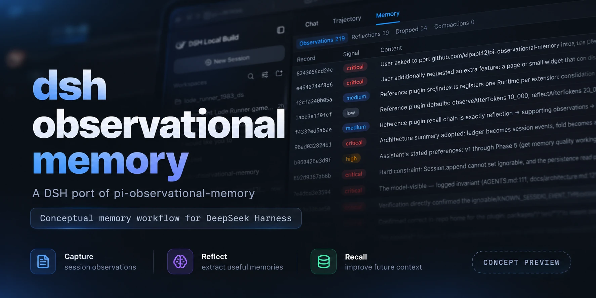

# Observational Memory for DeepSeek Harness

English | [中文](README.md)



An observational-memory plugin for long-running [DeepSeek Harness](https://github.com/deepseek-ai/deepseek-harness) sessions, adapted from [elpapi42/pi-observational-memory](https://github.com/elpapi42/pi-observational-memory). It captures useful facts while a session is active, keeps a traceable memory ledger, and renders that memory at compaction time instead of asking a model to summarize the same history again.

**This is a DeepSeek Harness implementation, not a Pi extension.** The installable `main` branch is host-only: it does not include a browser Memory panel and does not require changes to the Harness source tree.

## What it does

- **Observe, reflect, prune:** background workers record source-cited observations, distill longer-lived reflections, and bound the active memory pool. The conversation continues while they run.
- **Remember across compaction:** the plugin renders its stored memory into a compaction summary without a model call when the memory is non-empty and the result would shrink the compacted region. Otherwise it falls back to the standard summarizer.
- **Trace claims to their sources:** observations cite conversation entries; reflections cite observations. `/om show <id>` and the optional `memory_recall` tool follow those links, reporting missing evidence rather than inventing it.
- **Install without a Harness fork:** the ledger and recall tool are separate plugin bundles. The ledger owns a per-session JSON store instead of writing custom event types into the Harness session log.

## Packages

| Package | Role |
| --- | --- |
| [`@deepseek-ai/dsh-observational-memory`](packages/observational-memory/README.en.md) | Ledger, background workers, `/om` commands, and compaction integration. Install this first. |
| [`@deepseek-ai/dsh-tool-observational-memory`](packages/tool-observational-memory/README.en.md) | Optional `memory_recall` model tool. Requires the ledger bundle to be installed directly in the same profile. |

## Status and local installation

The packages are at **`0.1.5-rc.2`** in this repository. **They have not yet been published to npm.** For now, build and install them from a local checkout. This example uses the `web` profile; substitute your profile name if needed.

```bash
cd /path/to/dsh-observational-memory
pnpm install
pnpm run build
LEDGER_DIR="$PWD/packages/observational-memory"
TOOL_DIR="$PWD/packages/tool-observational-memory"

cd /path/to/deepseek-harness
pnpm dsh plugin --profile web add "$LEDGER_DIR"
pnpm dsh plugin --profile web add "$TOOL_DIR"
pnpm dsh --profile web web
```

Build again after changing plugin `src/`: the bundle loads `lib/`, and the packages do not have a prepack build hook. Install **both packages as direct profile dependencies** if you want `memory_recall`; installing only the tool leaves it waiting for the ledger store. The plugin bundles supply their own profile patches, so no Harness source changes or manual profile edits are needed.

To check the installation, run `/om status` in a session. `/om view` shows the memory block that compaction would render; `/om show <12-character-id>` resolves one record's provenance. The model can call `memory_recall` with an ID it has seen. An empty memory view in a new session is normal until an observation pass has run. There is no Web Memory tab on `main`.

## Storage and trade-offs

Memory is stored separately from session logs at `$DSH_HOME/observational-memory/<sessionId>.json` (by default `~/.dsh/observational-memory/`). Back up this directory along with your sessions: copying or replaying a session log alone does not carry its memory, and a fork starts with a new memory ledger. You can change the location with `storageDir`.

Background passes use an LLM and consume tokens. By default they use the session model; you can configure a different `model`. Their usage is not currently reflected in the Harness session token meter. Cadence, pool size, worker limits, and passive mode are configurable; see the [ledger package reference](packages/observational-memory/README.en.md#configuration).

## Browser UI experiment

The frozen [`parked/browser-ui` branch](FREEZE.md) preserves an earlier design with a read-only Memory tab beside Chat and Trajectory, plus a memory reading below the composer. **This is not part of the `main` release or an alternative install switch.** That design stored memory in session-log events and required a patch to DeepSeek Harness (including its known session event types and client wiring). The branch retains the plugin-side code and the Harness patch for reference; see [why it was parked](FREEZE.md). Do not apply that patch to use the standalone packages above.

## Origin and credits

This project builds on [pi-observational-memory](https://github.com/elpapi42/pi-observational-memory) by elpapi42 and its contributors: its observation → reflection → pruning model and traceable memory approach informed this implementation. The Harness-specific storage, compaction integration, commands, and package wiring are documented here and in the package references. Thanks to the upstream authors for publishing their work under the MIT license.

## License

MIT. Both packages declare `license: MIT` in their `package.json`, and the license text is in [`LICENSE`](LICENSE).

## Development

```bash
pnpm run build
pnpm run test
pnpm run check:artifacts
```

`pnpm run verify` runs the whole gate: build, typecheck, 100% per-file coverage, README-pairing, and the built-artifact check.

See [the frozen-line explanation](FREEZE.md) for the session-log trade-off and the package READMEs for configuration and implementation details.

## Repository layout

| Path | What it is |
| --- | --- |
| [`README.en.md`](README.en.md), [`FREEZE.md`](FREEZE.md) | The English front page, and why the earlier session-log line was parked |
| [`docs/decisions.md`](docs/decisions.md) | What `main` decided and what each decision costs |
| [`docs/design.md`](docs/design.md) | The design of the memory model both lines share — frozen-line-only sections are marked inline |
| [`docs/reference/`](docs/reference/) | Research on the upstream reference implementation this port is adapted from |
| [`AGENTS.md`](AGENTS.md), [`HANDOFF.md`](HANDOFF.md) | Maintainer entry point and current working state |

`AGENTS.md` and `HANDOFF.md` are working notes for maintainers and AI agents; the rest is user-facing.
